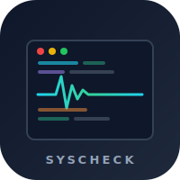
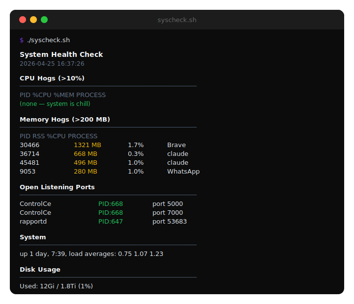

<p align="center">
  
</p>

<h1 align="center">syscheck</h1>

<p align="center">
  <strong>One command. Full system pulse. Zero dependencies.</strong>
</p>

<p align="center">
  <a href="#install"></a>
  <a href="LICENSE"></a>
  <a href="syscheck.sh"></a>
  <a href="syscheck.sh"></a>
</p>

<br/>

<p align="center">
  
</p>

<br/>

## Why

You open your laptop. The fans spin up. Something is eating CPU. Something else grabbed a port you need. An LLM is chewing through your RAM. You don't want to run five different commands to figure it out.

`syscheck` gives you the full picture in one shot.

## What it shows

```
  ⚡ syscheck  Apple M5 Max · May 01 12:17 · up 7 days, 3:19
  ━━━━━━━━━━━━━━━━━━━━━━━━━━━━━━━━━━━━━━━━━━━━━━━━━━━━━━━━━━
  🧠 CPU  ███████░░░░░░░░░░░░░  35%  usr:26.3% sys:8.5%
  💾 RAM  ████████░░░░░░░░░░░░  42%  15.4G/36.0G
  🎮 GPU  ███░░░░░░░░░░░░░░░░░  16%  render:16% vram:1.2G
  💿 DSK  ░░░░░░░░░░░░░░░░░░░░   1%  12Gi/1.8Ti
  🔄 SWP  ████████░░░░░░░░░░░░  44%  1363M/3072M
  ⚖️  LD   2.52 / 18 cores
  🌍 NET  ↓79.2G ↑15.6G  🔋 BAT  100% ⚡

  🤖 LLM  total cpu:10.7%  ram:1.6G
  ──────────────────────────────────────────────
  │ Claude       pid:62939  cpu:  0.0%  ram:946M
  │ Claude       pid:64850  cpu: 10.7%  ram:729M

  🔥 HOT
  ──────────────────────────────────────────────
  │ python             pid:62950  cpu:113.3%  mem:2.7%
  │ WindowServer       pid:403    cpu: 25.1%  mem:0.5%

  📊 MEM  (use --all for more)
  ──────────────────────────────────────────────
  │ python             pid:62950    1009M  cpu:105.4%
  │ WallpaperAerial    pid:734       988M  cpu:0.0%
  │ claude             pid:62939     946M  cpu:0.1%

  🌐 NET  (system ports hidden)
  ──────────────────────────────────────────────
  │ :8325   python3.1        pid:40256
  │ :52564  python3.1        pid:62950

  ━━━━━━━━━━━━━━━━━━━━━━━━━━━━━━━━━━━━━━━━━━━━━━━━━━━━━━━━━━
```

All output is color coded with progress bars. Green under 50%, yellow 50 to 80%, red above 80%.

| Section | Details |
|---|---|
| **🧠 CPU** | Total CPU usage with user/system split |
| **💾 RAM** | Memory usage with used/total breakdown |
| **🎮 GPU** | Apple Silicon GPU utilization, renderer %, VRAM in use |
| **💿 DSK** | Root disk usage |
| **🔄 SWP** | Swap usage (only shown when swap is active) |
| **⚖️ LD** | Load average vs core count |
| **🌍 NET** | Network bytes in/out since boot |
| **🔋 BAT** | Battery percentage and charging state |
| **🤖 LLM** | Local LLM processes with per process CPU and RAM |
| **🔥 HOT** | Processes using >10% CPU (hidden when idle) |
| **📊 MEM** | Top memory consumers (>500 MB) |
| **🌐 NET** | Listening TCP ports (system ports filtered by default) |

### LLM detection

Automatically detects and tracks resource usage for:

Ollama, LM Studio, MLX LM, llama.cpp, llamafile, Claude, OpenAI CLI, Jan, GPT4All, KoboldCpp, Text Generation Inference, vLLM, LocalAI, Msty

## Install

**Quick (curl)**

```bash
curl -fsSL https://raw.githubusercontent.com/elara-labs/syscheck/main/syscheck.sh -o /usr/local/bin/syscheck
chmod +x /usr/local/bin/syscheck
```

**Or clone**

```bash
git clone https://github.com/elara-labs/syscheck.git
cd syscheck
chmod +x syscheck.sh
```

**Or just copy the script.** It's a single file with no dependencies.

## Usage

```bash
syscheck            # default (compact, system ports filtered)
syscheck --all      # show all ports, more memory entries
syscheck -a         # same as --all
```

## Add to your shell

Drop this in your `.zshrc` or `.bashrc` to run it every time you open a terminal:

```bash
syscheck
```

Or alias it:

```bash
alias sc="syscheck"
```

## How it works

Composes standard macOS tools (`ps`, `lsof`, `df`, `top`, `vm_stat`, `ioreg`, `sysctl`, `pmset`, `netstat`) into a single formatted dashboard. No `sudo` required, no background daemons, no temp files.

GPU utilization is read from the Apple Silicon AGX accelerator via `ioreg`, giving real device utilization, renderer utilization, and VRAM usage without elevated privileges.

## Requirements

- macOS (Apple Silicon recommended for GPU metrics)
- Bash

## License

[MIT](LICENSE)
